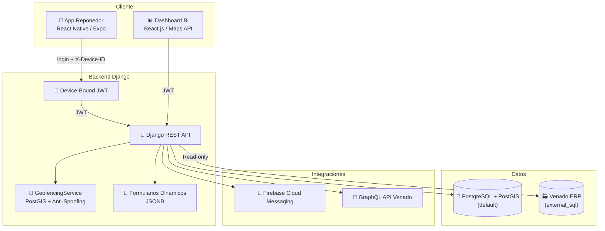
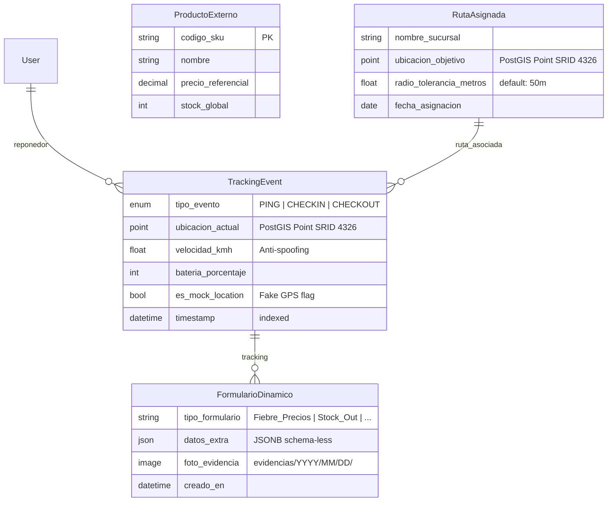
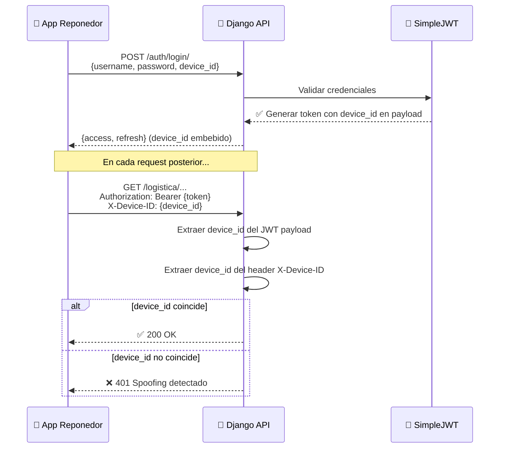
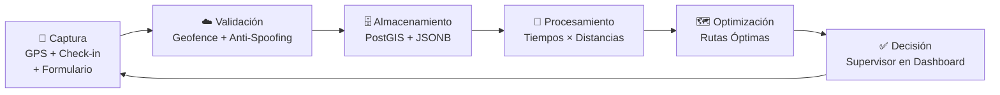

<p align="center">
  
  
  
  
  
</p>

# 🦌 Venaris Route

### Plataforma de Optimización Inteligente de Rutas

> **Innova Hack Santa Cruz 2026** — Reto Industrias Venado
>
> _Transformando la intuición logística en precisión matemática._

---

## 📋 Tabla de Contenidos

- [El Problema](#-el-problema)
- [La Solución](#-la-solución)
- [Arquitectura](#️-arquitectura)
- [Stack Tecnológico](#-stack-tecnológico)
- [Estructura del Proyecto](#-estructura-del-proyecto)
- [Instalación y Ejecución](#️-instalación-y-ejecución)
- [API Reference](#-api-reference)
- [Modelos de Datos](#️-modelos-de-datos)
- [Autenticación](#-autenticación)
- [Geofencing y Anti-Spoofing](#-geofencing-y-anti-spoofing)
- [Integraciones Externas](#-integraciones-externas)
- [Tests](#-tests)
- [Flujo Operativo](#-flujo-operativo)
- [Agentes AI](#-agentes-ai)
- [Equipo](#-equipo)
- [Licencia](#-licencia)

---

## 🎯 El Problema

La planificación de rutas en el **Canal Tradicional de Industrias Venado** se basa en tiempos promedio estimados y la intuición de la supervisión. No existe un cruce real entre:

- El **tiempo efectivo** de cada micro-tarea (limpieza, bandeo, POP) según el tipo de cliente
- La **distancia geográfica** real entre Puntos de Venta (PDVs)

Esto genera **ineficiencias logísticas** y subutilización del equipo de reponedores.

## 💡 La Solución

**Venado Route AI** elimina el micromanagement y automatiza la eficiencia operativa a través de un **Feedback Loop Continuo**:

| Componente | Descripción |
|---|---|
| 📱 **App Móvil** (Offline-First) | Check-in geofenced con validación anti-spoofing + formularios dinámicos |
| 🧠 **Motor de Ruteo** | Algoritmo que cruza tiempos reales × distancias geográficas |
| 📊 **Dashboard BI** | Métricas en tiempo real, desviaciones y mapas de cobertura |
| 🔐 **Seguridad** | JWT con device-binding + detección de GPS falso |

---

## 🏗️ Arquitectura



## 🔧 Stack Tecnológico

| Capa | Tecnología | Propósito |
|---|---|---|
| **Backend** | Django 4.2 + DRF | API REST, lógica de negocio |
| **Base de Datos** | PostgreSQL 15 + PostGIS 3.3 | Datos relacionales + geoespaciales |
| **Autenticación** | SimpleJWT (custom) | JWT con device-binding anti-spoofing |
| **Geofencing** | Django GIS + GEOS | Validación de presencia + anti-teleportación |
| **Notificaciones** | Firebase Admin SDK (FCM) | Push notifications a reponedores |
| **ERP** | GraphQL (`gql`) + DB externa | Datos de productos del ERP Venado |
| **Formularios** | JSONField (JSONB) | Formularios dinámicos sin esquema fijo |
| **Contenedores** | Docker Compose | Orquestación de servicios |
| **Testing** | Pytest + scripts standalone | Tests de integración y escenarios |

---

## 📁 Estructura del Proyecto

```
AI-For-Good/
├── apps/
│   └── logistica/                   ← App principal de logística
│       ├── api/
│       │   ├── serializers.py       ← Validación + lógica de geofencing
│       │   ├── urls.py              ← checkin/, formularios/, productos-erp/
│       │   └── views.py             ← CheckIn, Formulario, ProductoERP views
│       ├── management/commands/
│       │   └── init_db.py           ← Seed: admin user + sucursal de prueba
│       ├── models/
│       │   ├── geospatial.py        ← TrackingEvent, RutaAsignada (PostGIS)
│       │   ├── external.py          ← ProductoExterno (unmanaged, ERP)
│       │   └── forms.py             ← FormularioDinamico (JSONB)
│       ├── services/
│       │   └── geofencing.py        ← Validación geográfica + anti-spoofing
│       └── repositories/
├── agentes/                         ← System prompts para agentes AI
│   ├── DJANGO.md                    ← Agente Backend (Django + PostGIS + DRF)
│   ├── REACT.md                     ← Agente App Móvil (React Native + Expo)
│   ├── REACT_DEVICE.md              ← Agente Periféricos (Cámara, GPS, Batería)
│   └── GMAPS.md                     ← Agente Dashboard (Google Maps + BI)
├── config/
│   ├── settings/
│   │   ├── base.py                  ← Configuración base (PostGIS, dual-DB, DRF)
│   │   └── development.py           ← Config de desarrollo
│   ├── urls.py                      ← URLs raíz (api/auth/, api/logistica/)
│   └── wsgi.py / asgi.py
├── core/
│   ├── auth/
│   │   ├── authentication.py        ← DeviceJWTAuthentication (device-binding)
│   │   ├── serializers.py           ← DeviceTokenObtainPairSerializer
│   │   ├── views.py                 ← Login con device_id
│   │   └── urls.py                  ← login/, refresh/
│   └── database/
│       └── routers.py               ← ExternalSQLRouter (default ↔ external_sql)
├── integrity/
│   ├── firebase_sdk.py              ← FirebaseManager (Firestore + FCM)
│   └── graphql_client.py            ← GraphQLConsumer (API Venado, 3 retries)
├── requirements/
│   ├── base.txt                     ← Dependencias de producción
│   └── development.txt              ← pytest-django, black, flake8
├── AGENTS.md                        ← Contexto para Antigravity CLI
├── CLAUDE.md                        ← Contexto para Claude Code
├── .claude/                         ← Configuración de Claude Code
├── .agents/                         ← Configuración de Antigravity CLI
├── docker-compose.yml               ← PostGIS + Backend Django
├── Dockerfile                       ← Multi-stage (Python 3.11-slim + GDAL)
├── .env.example                     ← Variables de entorno de referencia
├── manage.py
├── pytest.ini                       ← Config pytest (markers: geo, integration)
├── test_api.py                      ← Smoke test de la API
└── test_scenarios.py                ← 4 escenarios de integración
```

---

## 🛠️ Instalación y Ejecución

Para una guía detallada, paso a paso, sobre cómo configurar este proyecto por primera vez (Backend, Frontend y App Móvil), consulta nuestra **[Guía de Configuración Inicial (SETUP.md)](./SETUP.md)**.

### Resumen Rápido (Quick Start)

**1. Levantar el Backend y Base de Datos:**
```bash
cp .env.example .env
docker compose up -d --build
```
*(El backend quedará disponible en http://localhost:8001)*

**2. Levantar Dashboard Web:**
```bash
cd frontend && npm install && npm run dev
```

**3. Levantar App Móvil:**
```bash
cd mobile-app && npm install && npm run start
```

---

## 📡 API Reference

Base URL: `http://localhost:8000/api/`

### 🔐 Autenticación

| Método | Endpoint | Headers Requeridos | Descripción |
|---|---|---|---|
| `POST` | `/auth/login/` | — | Login con `username`, `password`, `device_id` → JWT pair |
| `POST` | `/auth/refresh/` | — | Refrescar access token con refresh token |

### 📍 Logística

| Método | Endpoint | Auth | Descripción |
|---|---|---|---|
| `POST` | `/logistica/checkin/` | JWT + `X-Device-ID` | Check-in geofenced en una sucursal |
| `POST` | `/logistica/formularios/` | JWT + `X-Device-ID` | Enviar formulario dinámico (multipart con foto) |
| `GET` | `/logistica/productos-erp/` | JWT + `X-Device-ID` | Listar productos del ERP externo |

> ⚠️ **Todos los endpoints protegidos** requieren:
> - Header `Authorization: Bearer <access_token>`
> - Header `X-Device-ID: <device_id>` (debe coincidir con el embebido en el JWT)

### Ejemplo: Login + Check-in

```bash
# 1. Obtener JWT
curl -X POST http://localhost:8000/api/auth/login/ \
  -H "Content-Type: application/json" \
  -d '{"username": "admin", "password": "admin123", "device_id": "mi-dispositivo-001"}'

# 2. Check-in (usar el access token recibido)
curl -X POST http://localhost:8000/api/logistica/checkin/ \
  -H "Authorization: Bearer <access_token>" \
  -H "X-Device-ID: mi-dispositivo-001" \
  -H "Content-Type: application/json" \
  -d '{
    "ruta_id": 1,
    "latitud": -33.4489,
    "longitud": -70.6693,
    "velocidad_kmh": 5.0,
    "bateria_porcentaje": 85,
    "es_mock_location": false
  }'
```

---

## 🗄️ Modelos de Datos



| Modelo | Base de Datos | Managed |
|---|---|---|
| `RutaAsignada` | `default` (PostGIS) | ✅ Sí |
| `TrackingEvent` | `default` (PostGIS) | ✅ Sí |
| `FormularioDinamico` | `default` (PostGIS) | ✅ Sí |
| `ProductoExterno` | `external_sql` (ERP) | ❌ No (`managed = False`) |

---

## 🔐 Autenticación

El sistema implementa **Device-Bound JWT** — una extensión de SimpleJWT que vincula cada token a un dispositivo físico:



> **¿Por qué?** Un token robado y usado desde otro dispositivo será rechazado automáticamente.

---

## 📍 Geofencing y Anti-Spoofing

El `GeofencingService` implementa una **pipeline de validación triple** antes de aprobar un check-in:

| Capa | Validación | Criterio de Rechazo |
|---|---|---|
| 1️⃣ **Mock Location** | Flag del OS | `es_mock_location == True` |
| 2️⃣ **Velocidad** | Anomalía cinética | `velocidad_kmh > 150` (anti-teleportación) |
| 3️⃣ **Geofence** | Distancia PostGIS | Fuera del `radio_tolerancia_metros` de la sucursal |

**Cálculo de distancia**: GEOS spherical distance × 111,320 ≈ metros (conversión de grados WGS84).

---

## 🔗 Integraciones Externas

### Firebase Admin SDK

| Feature | Uso |
|---|---|
| **Firestore** | Persistencia híbrida de datos |
| **Cloud Messaging (FCM)** | Push notifications a reponedores (alertas geofencing, cambios de planograma) |

### GraphQL Client

- Conecta con `GRAPHQL_ENDPOINT` (API del ERP de Venado)
- Usa `RequestsHTTPTransport` con **3 retries** para resiliencia
- Aislado en `integrity/` para evitar fallos en cascada si el ERP cae

### Base de Datos Externa (ERP)

| Aspecto | Detalle |
|---|---|
| **Router** | `ExternalSQLRouter` en `core/database/routers.py` |
| **Routing** | Modelos con `use_external_db = True` → `external_sql` |
| **Acceso** | Solo lectura (`allow_migrate` → nunca en `external_sql`) |
| **Modelo** | `ProductoExterno` (tabla `venado_erp_productos`) |

---

## 🧪 Tests

### Ejecutar tests

```bash
# Smoke test de la API (requiere backend corriendo)
python test_api.py

# Escenarios de integración (4 casos)
python test_scenarios.py

# Pytest (para unit tests)
pytest -v
```

### Escenarios de prueba (`test_scenarios.py`)

| # | Escenario | Resultado Esperado |
|---|---|---|
| 1 | Check-in dentro del geofence (100m) | ✅ Aprobado |
| 2 | Check-in fuera del geofence (Santiago Centro → Providencia) | ❌ Rechazado |
| 3 | Check-in con `es_mock_location = True` | 🚫 Bloqueado |
| 4 | Check-in con velocidad imposible (250 km/h) | 🚫 Bloqueado |

### Markers de Pytest

```ini
[pytest]
markers =
    geo: Tests geoespaciales (PostGIS)
    integration: Tests de integración (Firebase, GraphQL)
```

```bash
# Solo tests geoespaciales
pytest -m geo

# Solo tests de integración
pytest -m integration
```

---

## ⚙️ Flujo Operativo (Feedback Loop)



1. **Captura**: El reponedor valida su GPS, hace check-in y llena formularios dinámicos en la app
2. **Validación**: Pipeline anti-spoofing (mock location → velocidad → geofence)
3. **Almacenamiento**: Tracking events en PostGIS, formularios en JSONB
4. **Procesamiento**: Motor recalcula tiempos promedios reales × distancias geográficas
5. **Optimización**: Se generan rutas matemáticamente óptimas
6. **Decisión**: El supervisor aprueba o ajusta desde el Dashboard BI

---

## 🤖 Agentes AI

El directorio `agentes/` contiene **system prompts especializados** que dan a los asistentes de IA (Claude, Gemini, ChatGPT, etc.) contexto profundo sobre el proyecto para acelerar el desarrollo durante el hackathon.

| Agente | Archivo | Responsabilidad |
|---|---|---|
| 🐍 **Backend Django** | [`DJANGO.md`](agentes/DJANGO.md) | Arquitectura del backend, modelos PostGIS, API REST, autenticación device-bound JWT, geofencing, dual-DB routing, integraciones Firebase/GraphQL |
| 📱 **App React Native** | [`REACT.md`](agentes/REACT.md) | App móvil Expo offline-first para reponedores: check-in GPS, cronómetro de micro-tareas, formularios dinámicos con foto, cola de sincronización |
| 📸 **App Periféricos** | [`REACT_DEVICE.md`](agentes/REACT_DEVICE.md) | Integración avanzada con hardware móvil: GPS de alta precisión, anti-spoofing, compresión de cámara, y optimización de batería |
| 🗺️ **Dashboard Maps** | [`GMAPS.md`](agentes/GMAPS.md) | Dashboard BI con Google Maps: visualización de rutas (planificada vs real), pines por tipo de cliente, geofences, métricas de cobertura y eficiencia |

### ¿Cómo usarlos?

Copia el contenido del archivo `.md` correspondiente como **system prompt** de tu agente AI, o referéncialo directamente si tu herramienta lo soporta:

```bash
# Ejemplo con Claude Code
cat agentes/DJANGO.md  # Copiar como system prompt para tareas de backend
cat agentes/REACT.md   # Copiar como system prompt para tareas de app móvil
cat agentes/GMAPS.md   # Copiar como system prompt para tareas de dashboard
```

Cada prompt incluye:
- Rol del agente y contexto del proyecto
- Stack técnico actual con modelos y endpoints reales
- Reglas de desarrollo específicas al área
- Estructura de archivos/componentes sugerida
- Output esperado

---

## 👥 Equipo

> Desarrollado durante las **48 hrs** del Innova Hack Santa Cruz — 2026

<!-- Agregar nombres e integrantes del equipo -->

---

## 📄 Licencia

MIT
